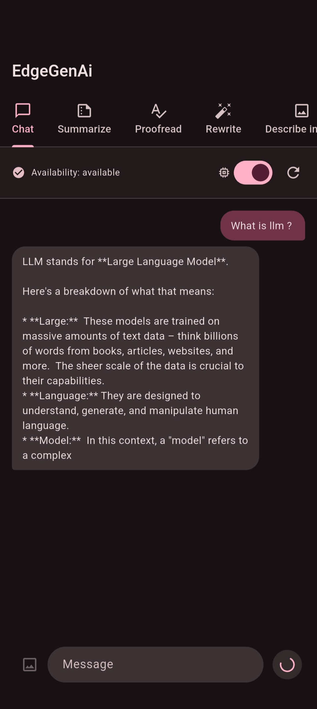
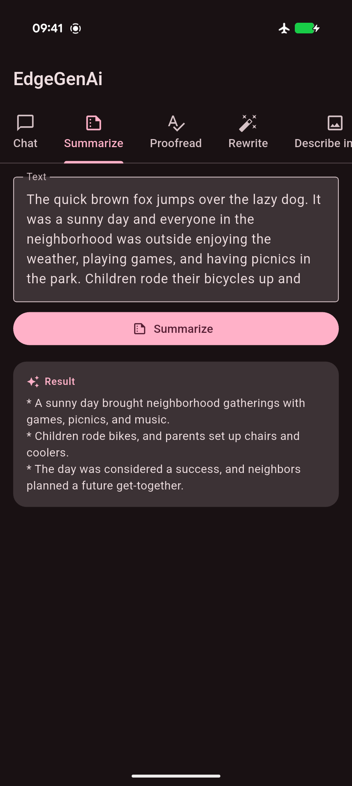
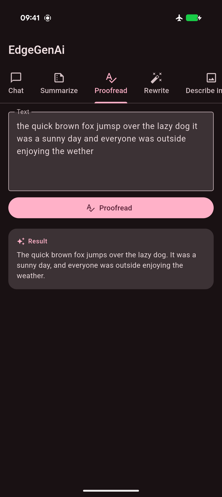
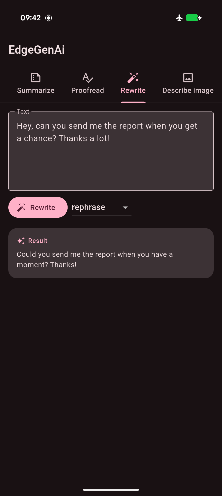
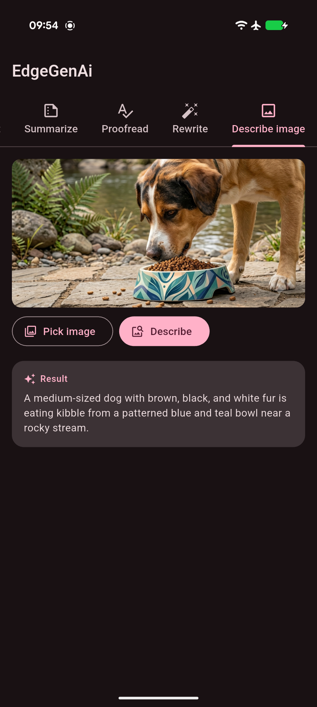

# edge_gen_ai

A Flutter plugin for **on-device** generative AI. It wraps Apple's Foundation
Models (iOS) and Google's Gemini Nano via ML Kit GenAI (Android) behind one
Dart API — no network calls, no cloud API keys, no data leaving the phone.

It uses the model the OS already ships with, so there's no model file to
manage; `downloadModel()` just triggers the OS's own on-demand delivery of
that shared system model when it isn't ready yet.

> [!IMPORTANT]
> **Platform versions matter a lot here:**
> - **iOS 26+** required, with Apple Intelligence enabled in Settings.
>   **iOS 27+** required for image input (Foundation Models `Attachment`, Beta).
> - **Android** API 26+ on a device with Gemini Nano/AICore support
>   (e.g. Pixel 8+, Samsung S23+). **Android's backend is Beta** —
>   ML Kit GenAI APIs have no SLA or backward-compatibility guarantee.
>   See [ML Kit GenAI](https://developers.google.com/ml-kit/genai).
>
> Use `checkAvailability()` to detect unsupported OS versions, disabled
> Apple Intelligence, or missing AICore support at runtime.

## Features

| Class | Task | Details | Screenshot |
| --- | --- | --- | --- |
| `EdgeGenAIPrompt` | `generateContent()` | Free-form prompt, streamed response, optional image input and conversation memory. |  |
| `EdgeGenAISummarizer` | `summarize()` | Summarizes text as bullet points. |  |
| `EdgeGenAIProofreader` | `proofread()` | Fixes grammar, spelling, and punctuation. |  |
| `EdgeGenAIRewriter` | `rewrite()` | Rewrites text in a chosen `EdgeGenAIRewriteStyle`. |  |
| `EdgeGenAIImageDescriber` | `describeImage()` | Describes an image. |  |

Every class exposes `checkAvailability()` and `downloadModel()` alongside its
task method. On Android these map to ML Kit GenAI's dedicated APIs; on iOS
they're task-specific prompts to the same Foundation Model that backs
`EdgeGenAIPrompt`.

- **Availability + download**: `checkAvailability()` reports ready /
  downloadable / not-enabled / unsupported. `downloadModel()` streams
  download progress on Android; on iOS it completes immediately (nothing
  to download).
- **Conversation memory**: `EdgeGenAIPrompt(useMemory: true)` remembers
  prior turns; `resetConversation()` starts over. Stateless by default.

## Usage

```dart
import 'package:edge_gen_ai/edge_gen_ai.dart';

final prompt = EdgeGenAIPrompt();

// 1. Check whether the on-device feature is ready.
final availability = await prompt.checkAvailability();

// 2. If needed, download it (no-op on iOS).
if (availability == EdgeGenAIAvailability.downloadable) {
  await for (final progress in prompt.downloadModel()) {
    print('${progress.status}: ${progress.bytesDownloaded ?? ''}');
  }
}

// 3. Generate content. Each event is the full text generated so far.
await for (final chunk in prompt.generateContent(
  'Write a 3 sentence story about a magical dog.',
  options: EdgeGenAIGenerationOptions(temperature: 0.8, maxOutputTokens: 256),
)) {
  print(chunk);
}

// Optionally attach a single image (encoded bytes, e.g. PNG or JPEG).
await for (final chunk in prompt.generateContent(
  'What is in this picture?',
  image: imageBytes,
)) {
  print(chunk);
}
```

Hold a memory-enabled conversation across calls:

```dart
final chat = EdgeGenAIPrompt(useMemory: true);
await for (final chunk in chat.generateContent('My name is Alex.')) {}
await for (final chunk in chat.generateContent('What is my name?')) {
  print(chunk); // remembers "Alex"
}
await chat.resetConversation(); // start fresh
```

Use the task-specific features (each has its own `checkAvailability()` /
`downloadModel()`, exactly like `EdgeGenAIPrompt`):

```dart
final summary = await EdgeGenAISummarizer().summarize(longArticle);

final corrected = await EdgeGenAIProofreader().proofread('the quick brown fox jumsp');

final formal = await EdgeGenAIRewriter().rewrite(
  'hey, meeting is off',
  style: EdgeGenAIRewriteStyle.professional,
);

final description = await EdgeGenAIImageDescriber().describeImage(imageBytes);
```

See the [example app](example/lib/main.dart) for a chat UI and a text-tools
demo built on top of this API.
